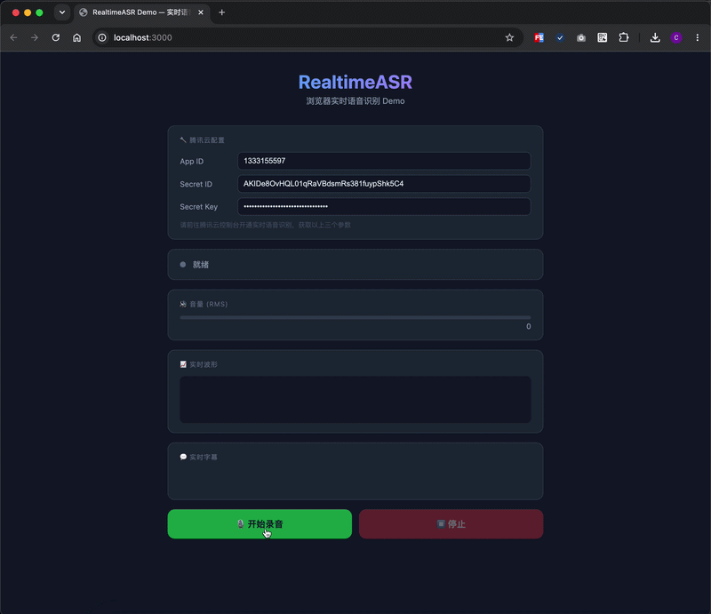

# RealtimeASR SDK

> Browser Realtime Speech Recognition SDK — 浏览器实时语音识别

一个专注于**浏览器实时语音识别**的 TypeScript SDK，提供完整的录音链路，但不负责 UI。



```
Mic → PCM → ASR → Text
```

## ✨ 特性

- 🎙️ **浏览器麦克风录音** — AudioWorklet 低延迟采集
- 🔊 **实时音量计算** — RMS 算法，0~100
- 📈 **实时波形数据** — Float32Array，Canvas/SVG/WebGL 任选
- 🔄 **自动重采样** — 48kHz → 16kHz 线性插值
- 📦 **PCM16 编码** — Float32 → Int16
- ⚡ **二进制 WebSocket** — 不经过 Base64
- 🧩 **Provider 架构** — Core 与 ASR 服务完全解耦
- 🔒 **TypeScript Strict** — 完整类型支持，禁止 `any`

## 📦 包结构

```
packages/
├── core/                  # 录音引擎 + 音频处理
├── provider-tencent/      # 腾讯云 ASR Provider
└── shared/                # 共享类型定义
```

## 🚀 快速开始

### 安装

```bash
pnpm install
pnpm build
```

### 使用

```ts
import { RealtimeASR } from '@realtime-asr/core'
import { TencentProvider } from '@realtime-asr/provider-tencent'

const recorder = new RealtimeASR({
  provider: new TencentProvider({
    appId: 'your-app-id',
    secretId: 'your-secret-id',
    secretKey: 'your-secret-key',
  }),
})

// 实时字幕
recorder.on('partial', (text) => {
  console.log('实时:', text)
})

// 最终结果
recorder.on('final', (text) => {
  console.log('最终:', text)
})

// 音量
recorder.on('volume', (vol) => {
  console.log('音量:', vol) // 0~100
})

// 波形
recorder.on('wave', (data) => {
  drawWaveform(data) // Float32Array
})

// 开始录音
await recorder.start()

// 停止录音
await recorder.stop()

// 销毁
await recorder.destroy()
```

## 🏗️ 架构

```
                    Business
                        │
                   RealtimeASR
                        │
               ┌────────┴────────┐
           Recorder          Provider
               │                  │
       ┌───────┼───────┐    TencentProvider
       │       │       │         │
  AudioEngine  │  FrameBuffer  Signer
       │       │       │         │
  AudioWorklet │  VolumeMeter  WebSocket
       │       │                 │
  PCMEncoder  Resampler       Parser
       │                       │
  EventEmitter ◄───────────────┘
```

## 📋 API

### RealtimeASR / Recorder

| 方法 | 说明 |
|------|------|
| `new RealtimeASR(options)` | 创建实例 |
| `await recorder.start()` | 开始录音 |
| `await recorder.stop()` | 停止录音 |
| `await recorder.destroy()` | 销毁实例 |
| `recorder.on(event, handler)` | 注册事件 |
| `recorder.off(event, handler)` | 移除事件 |
| `recorder.getState()` | 获取当前状态 |

### 事件

| 事件 | 类型 | 说明 |
|------|------|------|
| `start` | `void` | 开始录音 |
| `stop` | `void` | 停止录音 |
| `partial` | `string` | 实时字幕（中间结果） |
| `final` | `string` | 最终字幕（一句结束） |
| `volume` | `number` | 音量 0~100 |
| `wave` | `Float32Array` | 实时 PCM 波形数据 |
| `error` | `Error` | 错误信息 |

### 配置

```ts
interface RecorderOptions {
  provider: ASRProvider    // ASR Provider 实例（必填）
  sampleRate?: number      // 目标采样率，默认 16000
  channels?: number        // 声道数，默认 1
  frameDuration?: number   // 帧时长(ms)，默认 200
  debug?: boolean          // 开启调试日志
}
```

## 🔌 Provider

### 腾讯云 (Tencent Cloud)

使用前请在[腾讯云控制台](https://console.cloud.tencent.com/asr)开通实时语音识别服务。

```ts
const provider = new TencentProvider({
  appId: 'your-app-id',
  secretId: 'your-secret-id',
  secretKey: 'your-secret-key',
  engineModelType: '16k_zh',  // 可选
  needVad: 0,                 // 可选
})
```

### 自定义 Provider

实现 `ASRProvider` 接口即可接入任意 ASR 服务：

```ts
interface ASRProvider {
  connect(): Promise<void>
  send(buffer: ArrayBuffer): void
  close(): Promise<void>
  on(event: string, handler: (...args: any[]) => void): void
  off(event: string, handler: (...args: any[]) => void): void
}
```

## 🖥️ Demo

项目提供了一个基于 Vite + Vanilla TypeScript 的本地 Demo，可直接在浏览器中体验实时语音识别。

### 启动步骤

```bash
# 1. 安装依赖（首次）
pnpm install

# 2. 构建 SDK 包
pnpm build

# 3. 启动 Demo（在项目根目录）
pnpm demo
```

或进入 Demo 目录手动启动：

```bash
cd examples/vanilla
pnpm dev
```

浏览器自动打开 `http://localhost:3000`：

1. 填入腾讯云 **App ID**、**Secret ID**、**Secret Key**
2. 点击 **"开始录音"** 按钮
3. 对着麦克风说话，页面实时展示：
   - 🔊 音量条（RMS 0~100）
   - 📈 Canvas 波形图
   - 💬 实时字幕（Partial）
   - 📋 最终结果列表（Final）

### 开发说明

Demo 通过 Vite 的 `resolve.alias` 直接引用 TypeScript 源码（`packages/*/src/`），修改 SDK 源码后刷新浏览器即可生效，无需重新 build。

## 🛠️ 构建

```bash
# 安装依赖
pnpm install

# 构建所有包
pnpm build

# TypeScript 监听模式
pnpm dev
```

## 📄 License

MIT
